# Creating a new Hydrogen storefront — step by step

How to stand up one more storefront on the Wine Gift Shop store: a Hydrogen
environment on Shopify, wired to this repository, with its own Weaverse
project for content.

Three tabs open throughout: **Shopify admin**, **Weaverse**, **GitHub**.

Roughly 20 minutes, most of it waiting for deployments.

---

## Phase 1 — Create the storefront in Shopify

**Shopify admin → Hydrogen → Create storefront.**

Give it a **storefront name** (we use the domain, e.g. `kpmggift.com`), choose
**Set up GitHub continuous deployment now**, and point it at:

- **Account:** `fewinery`
- **Repository:** `wine-gift-shop-hydrogen`

If GitHub is not connected yet, connect it here first.

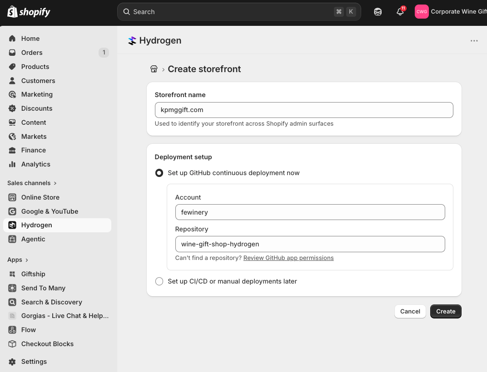

Press **Create**. Shopify creates the API tokens, the Oxygen resources, and
then connects to GitHub.

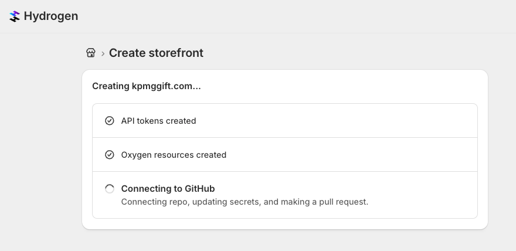

---

## Phase 2 — Merge the bot's pull request

Creating the storefront makes Shopify's bot open a **pull request** on our
repository, on a branch named something like
`shopify-setup-oxygen-workflow-xxxx`. It adds the deployment workflow for the
new storefront.

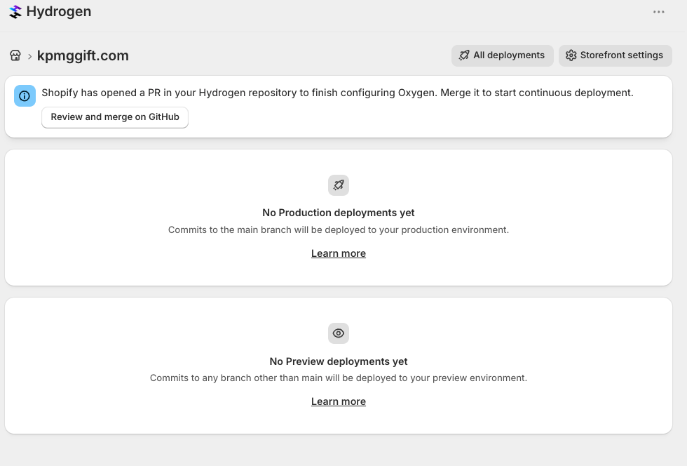

Merge it — from Shopify or from GitHub, either works.

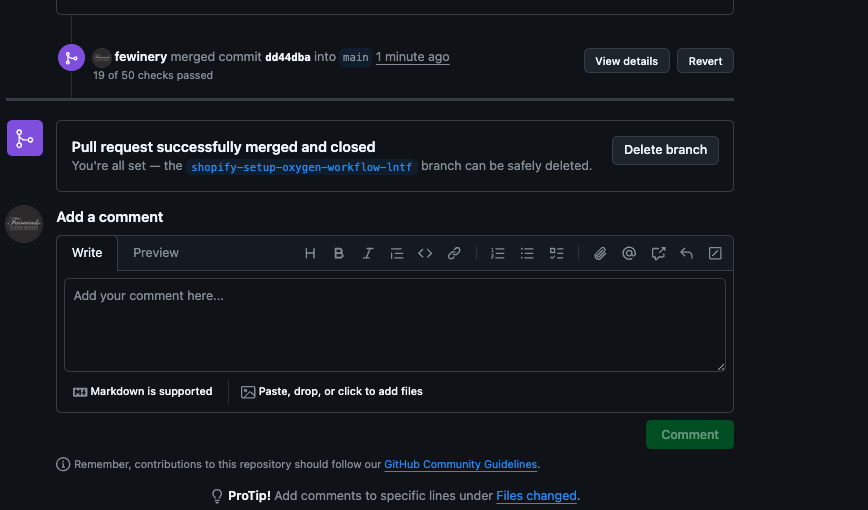

> Not every check has to pass. The repo runs a workflow per storefront, so a
> single PR shows dozens of checks and only some are relevant. GitHub is done
> after this merge; everything else happens in Shopify and Weaverse.

---

## Phase 3 — Environment variables

**Hydrogen → the storefront → Settings → Environment variables.**

A new storefront arrives with nothing but `SESSION_SECRET` under **Custom
variables**. The Shopify-supplied ones (store domain, storefront API token
and so on) sit below under **Read-only variables** and need no attention.

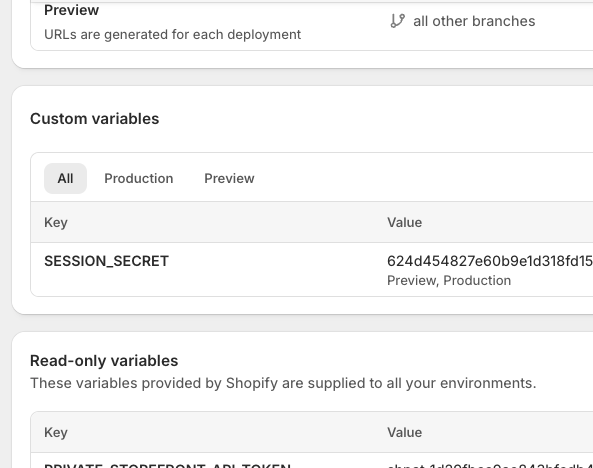

**The site will not build without these four:**

| Variable | Where it comes from |
| --- | --- |
| `SESSION_SECRET` | Created automatically. Leave it |
| `WEAVERSE_PROJECT_ID` | Phase 4 below |
| `HEADER_MENU_HANDLE` | The Shopify navigation menu handle for the header |
| `FOOTER_MENU_HANDLE` | The Shopify navigation menu handle for the footer |

Menu handles come from **Shopify → Content → Menus**; the handle is the last
part of the menu's URL.

Create `WEAVERSE_PROJECT_ID` first — go get its value now, then come back and
add the rest.

Other variables are per feature and can be added later: `KLAVIYO_*`,
`JUDGEME_PRIVATE_API_TOKEN`, `SHOPIFY_APP_CLIENT_ID` / `_SECRET`,
`PUBLIC_GOOGLE_GTM_ID`, and so on. See `.env.example` and `env.d.ts` for the
full list, and `guides/entry-form.md` for the entry form's variables.

> Set each variable for **both** Preview and Production, and redeploy
> afterwards — Oxygen reads them at boot, not per request.

---

## Phase 4 — Create the Weaverse project

**Weaverse → Projects → Create new Project.**

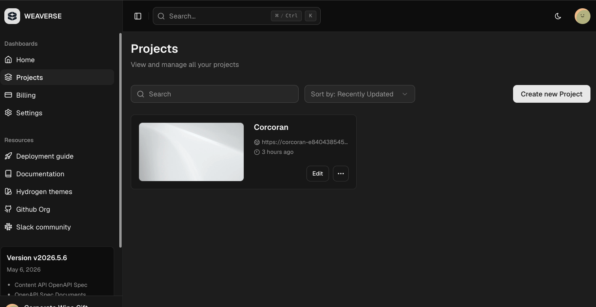

Select the **Pilot** theme. Weaverse then offers to set the project up for
you — **do neither**. Do not run the local install, do not deploy to cloud.

All you want from this screen is the **project ID**, highlighted inside the
CLI command. Copy it.

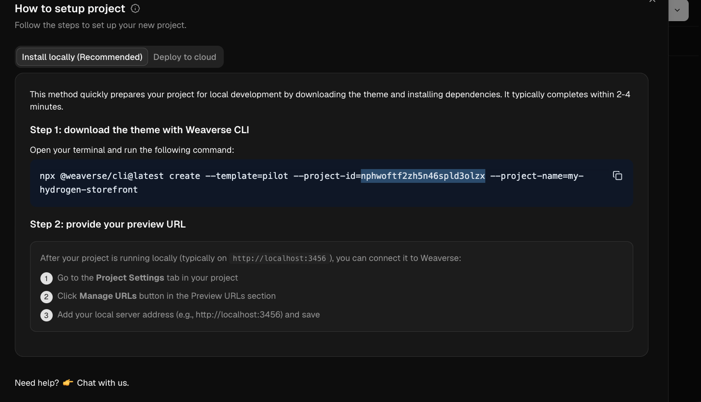

Paste it into `WEAVERSE_PROJECT_ID` back in Shopify, add the two menu handles,
and let the storefront redeploy.

---

## Phase 5 — Make the environment public

By default a new environment's URL is **Private**, meaning only staff accounts
can open it — which looks like a broken site to everyone else.

**Hydrogen → the storefront → Environments → Production → Edit**, then switch
**URL privacy** from Private to **Public**.

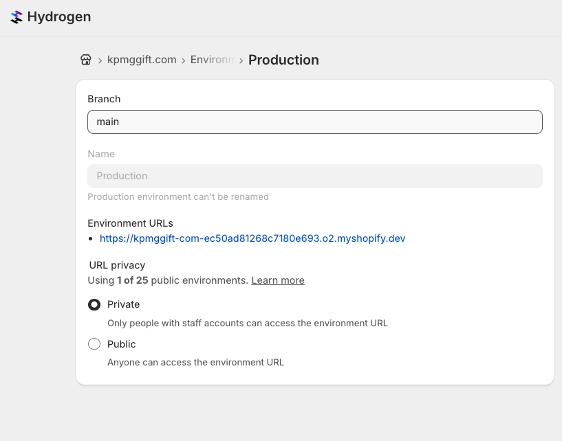

Copy the environment URL while you are here
(`https://<name>-<id>.o2.myshopify.dev`). Phase 6 needs it.

---

## Phase 6 — Point Weaverse at the storefront

Open the project in Weaverse. It will be blank and still called **My Hydrogen
storefront**. Rename it from the **⋮** menu top-right so it is findable later.

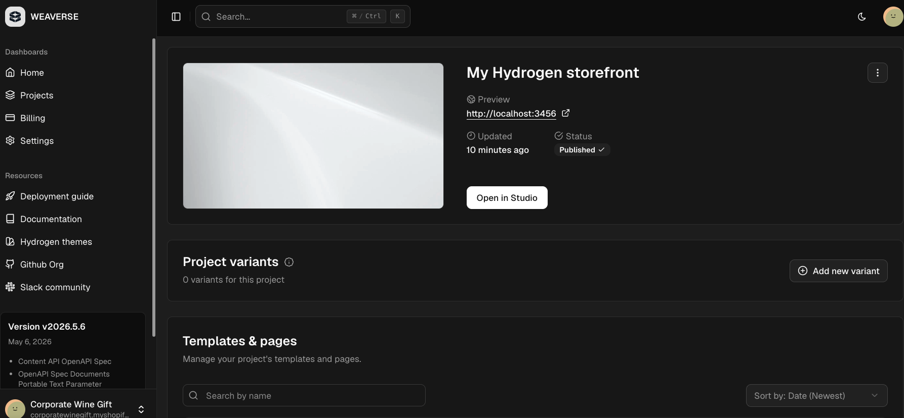

Open the Studio and it will fail with **Preview Connection Lost** — expected.
A fresh project points at `http://localhost:3456`, and we are not running the
theme locally.

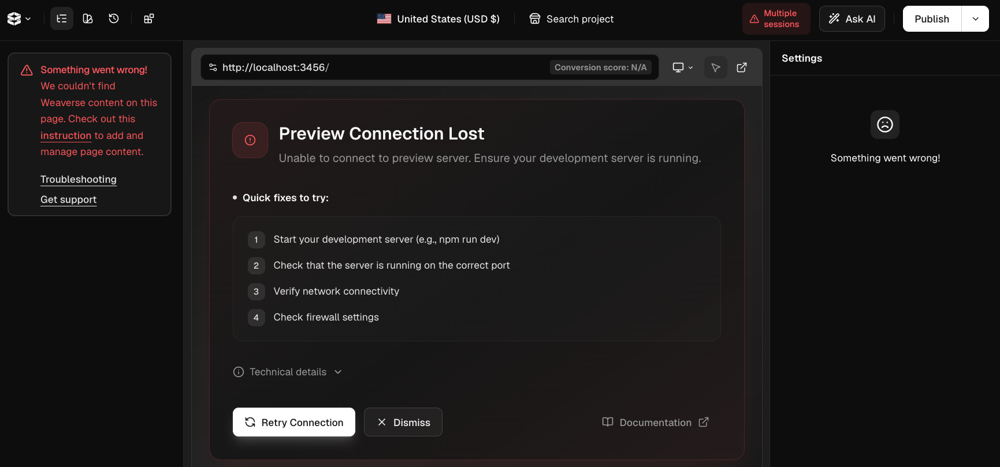

Fix it in **Project Settings → Preview URLs → Manage previews**.

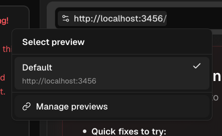

Under **Add new preview**, give it a reference name and paste the Oxygen
environment URL from Phase 5, then **Add new preview**.

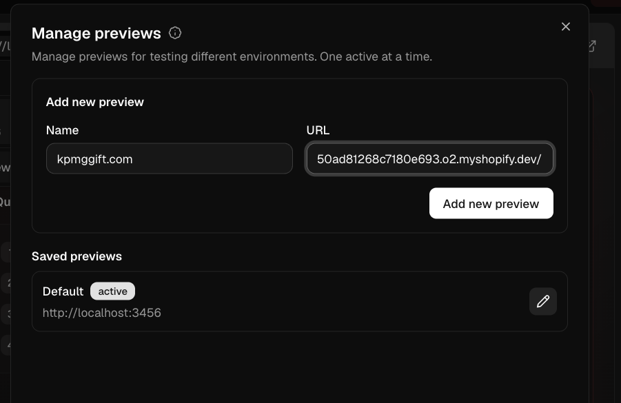

Then, in **Saved previews**, press **▶ (Set as active)** on the one you just
added, and **delete the `Default` / localhost entry**. Leaving it there causes
confusion later, when someone finds the Studio pointing at a localhost that
nobody is running.

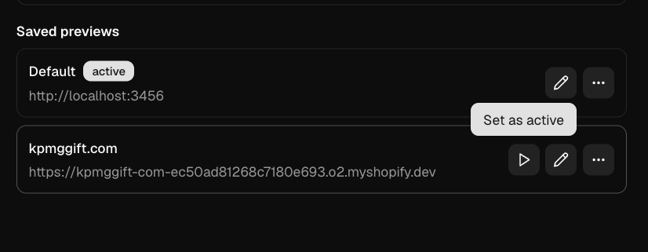

Reopen the Studio — it should now render the live storefront.

---

## Phase 7 — Copy content from an existing storefront

Rather than building every page again, export a project that is already set up
the way you want and import it into the new one.

In the **source** project: **⋮ → Export project**. This saves a file with its
pages, templates, designs and content.

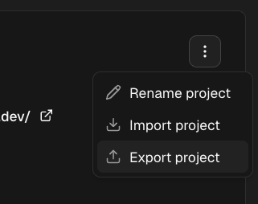

In the **new** project: **⋮ → Import project**, and upload that file.

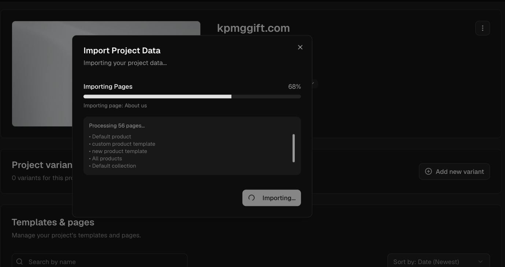

It processes every page — 50+ on a full storefront — so give it a minute.
Afterwards, go through and change what is brand-specific: logo, colours,
fonts, menus, images, and anything pointing at the old brand's domain.

---

## Checklist

- [ ] Storefront created in Shopify, pointed at `fewinery/wine-gift-shop-hydrogen`
- [ ] Bot's pull request merged
- [ ] Weaverse project created, theme **Pilot**, project ID copied
- [ ] `WEAVERSE_PROJECT_ID`, `HEADER_MENU_HANDLE`, `FOOTER_MENU_HANDLE` set on Preview **and** Production
- [ ] Environment URL switched to **Public**
- [ ] Weaverse project renamed
- [ ] Preview URL added, set active, `Default`/localhost deleted
- [ ] Content imported from an existing project
- [ ] Storefront opens on its `o2.myshopify.dev` URL
- [ ] Custom domain pointed at it, when ready

---

## If something goes wrong

| Symptom | Cause |
| --- | --- |
| Build fails right after creation | One of the four required variables is missing |
| Site loads but has no header or footer menu | `HEADER_MENU_HANDLE` / `FOOTER_MENU_HANDLE` wrong — check the handle in Shopify → Content → Menus |
| URL asks for a staff login | Environment is still **Private** (Phase 5) |
| Studio shows **Preview Connection Lost** | Preview URL still points at localhost (Phase 6) |
| Studio is blank but the site works | `WEAVERSE_PROJECT_ID` does not match the project you are editing |
| Variable changed but nothing happened | Redeploy — Oxygen reads variables at boot |
